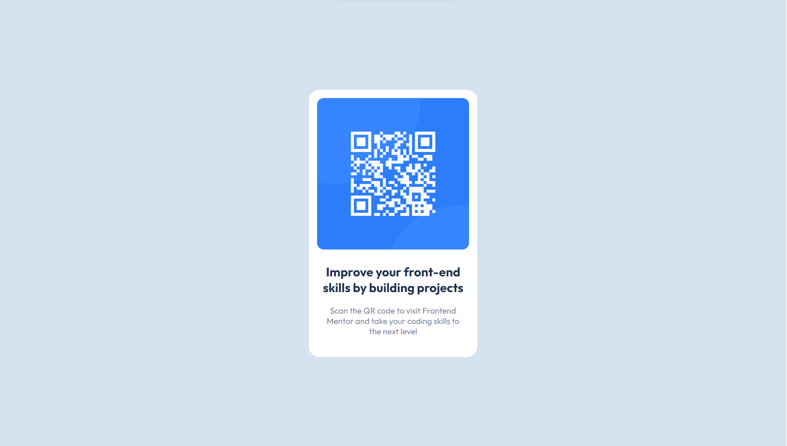

# Frontend Mentor - QR code component solution

This is a solution to the [QR code component challenge on Frontend Mentor](https://www.frontendmentor.io/challenges/qr-code-component-iux_sIO_H). Frontend Mentor challenges help you improve your coding skills by building realistic projects. 

## Table of contents

- [Overview](#overview)
  - [Screenshot](#screenshot)
  - [Links](#links)
- [My process](#my-process)
  - [Built with](#built-with)
  - [What I learned](#what-i-learned)
  - [Continued development](#continued-development)
  - [Useful resources](#useful-resources)
- [Author](#author)
- [Acknowledgments](#acknowledgments)



### Links

- Solution URL: [QR-code-component repository](https://github.com/echodavid/QR-code-component.git)
- Live Site URL: [QR-code-component GitHub Page](https://echodavid.github.io/QR-code-component/)

## My process

### Built with

- Semantic HTML5 markup
- CSS custom properties
- Flexbox
- CSS Grid
- Mobile-first workflow

### What I learned

I learned how to use css variables to make the code more readable and easier to maintain. I also learned how to use classes to make the code more reusable.
```css
.flex-container{
  display: flex;
  align-items: center;
  justify-content: center;
  flex-direction: column;
  
}
```

### Continued development

I would like to continue to learn mobile-first workflow and how to make the code more reusable. I also want to learn how to make a website more accessible and responsive.

### Useful resources

- [Emmet Documentation](https://docs.emmet.io/abbreviations/) - This helped me for the Emmet abbreviations. I really liked this pattern and will use it going forward.

## Author

- Website - [David Espinosa](https://github.com/echodavid)
- Frontend Mentor - [@echodavid](https://www.frontendmentor.io/profile/echodavid)
